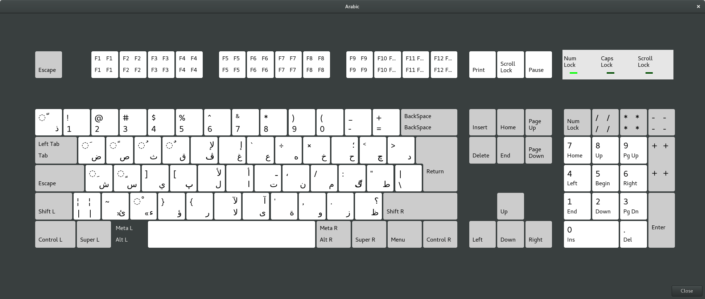

# Arabic XKB layout for Dvorak hardware keyboard

This layout was created to retain the Arabic "QWERTY" layout when using a Dvorak hardware keyboard.



### Installation

The included script "install.sh" will apply patches to the appropriate files provided they are not already patched, and that dry-run patches succeed. The script does require super user privileges to modify the XKB files.

To install:

```sh
sudo ./install.sh
```

Backup copies of the patched files are created in the same directory as the originals as "&lt;filename>.orig".

### Testing

This layout has only been tested on an up-to-date (as of 2016-03-11) 64-bit Arch Linux system running Gnome with a hardware Dvorak keyboard. No other distributions, desktop environments, etc. have been tested.

### Files modified

- /usr/share/X11/xkb/symbols/ara
- /usr/share/X11/xkb/rules/evdev.xml
